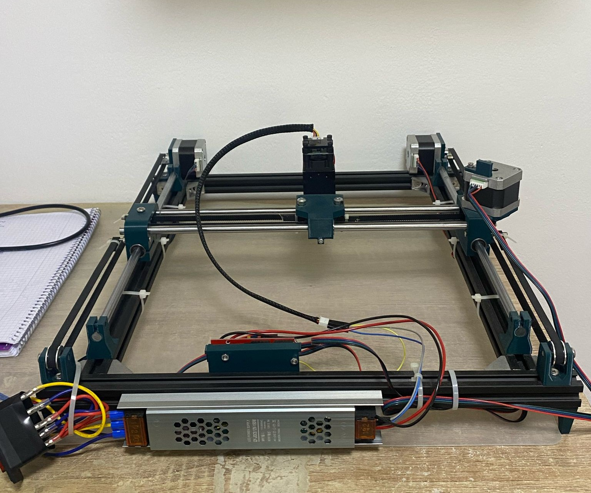

# HPGL Laser Engraver Controller

This project is a laser engraving system powered by an Arduino UNO R3 with a CNC Shield. It interprets HPGL vector files to control motion and laser activation, enabling precise 2D engraving on wood and printed circuit boards (PCBs).
## Features

- Serial connection to the Arduino for job control
- HPGL file loading and on-screen path preview
- Laser power adjustment and manual test fire
- Real-time progress updates

## Hardware Specifications

- Arduino UNO R3
- CNC Shield with 3 stepper motors (A4988 drivers)
- 150W 12V power supply
- 5.5W laser module.
- Aluminum frame with timing belts and pulleys

## Images

**Controller Interface:**

**Laser Engraving in Progress:**

**Machine Assembly:**

## Construction Guide

The mechanical and electronic design is based on the guide by How To Mechatronics. For full assembly instructions, see:

[https://youtu.be/NyUJvcocJpA?si=myNC3hPzi_oGE35C](https://youtu.be/NyUJvcocJpA?si=myNC3hPzi_oGE35C)
